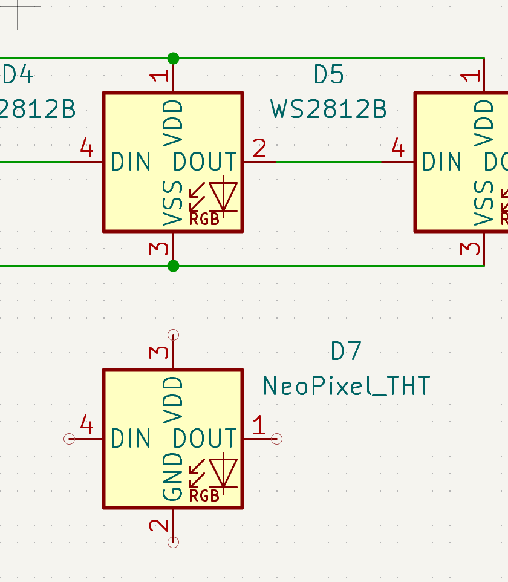

## July 1: Started the design :D

I have no idea what I'm doing ):

Looked through many components today to work on my BOM. Downloaded Fusion 360 to work on casing :O

Decided that tbh using Adafruit Sparkle Motion Mini and using WLED is easier than buying an esp32, i2s mems mic, level shifter, resistor, etc... so... prebuilt mini pcb for the win ig. I'm saving money :star_struck:

Due to my lack of knowledge of hardware: have discovered a problem with my original thought (3 separate led chains, one for center bow connected to either pin 32/33 on front, 2 for star clips, connected to gpio pins on back) - gpio pins on the back are 3V, not 5V, and I do not want to deal with a level shifter for just one chain of leds so I'm just combining one star led chain to the bow chain and putting both on the front which has the level shifter built in yayyyy.

Have realized magnetic connectors are very expensive ):
However, I do not want to deal with jst connectors because I will have these wired exposed and I want to use my own white silicone wires to have a droop effect and I do not want to crimp them for jst connectors, so magnetic connector it is.

Started schematic for project, but I did not understand how connecters work in schematic. ): I'm using the schematic to show wiring for the whole project, but only part is a pcb, so that I put in a heirarchical sheet. Don't think this is how they're meant to be used oops.

Pcb itself will be star shaped for the clip, just connecting leds together and have 3 holes to connect wires to. There exists some sense of rotational symmetry, as such same pcb can be used for both left and right star clip, just rotated. Star drawn with kaleidescope symmetry, imported graphic into Kicad to trace on edge cuts later.

My beautiful star shape:

Accidentally used the wrong symbol in schematic so pins were wrong in the pcb :sob: Had to redo them. There is probably a more efficient way to use Kicad but I don't know how to do that so I have to redo basically most my pcb :smiley: ... work for tmr

My incorrect symbols that had me redo everything:

I have learned: pay attention the to notch and pins ):
Neopixels are in fact built diff.

Time spent today: 3hr

## July 2: still doing design ):

Hopefully this pcb works :D 

Have fixed it and Kicad design rules checker says it works?
Will be soldering wire directly to holes on the side.

Will hopefully add a pretty silkscreen later if I have time :D
Because there is quite literally nothing but leds on this, it is very empty and sad right now.

Also just realized I have forgotten to commit to Github since yesterday oops :smiley:

Time spent today: 