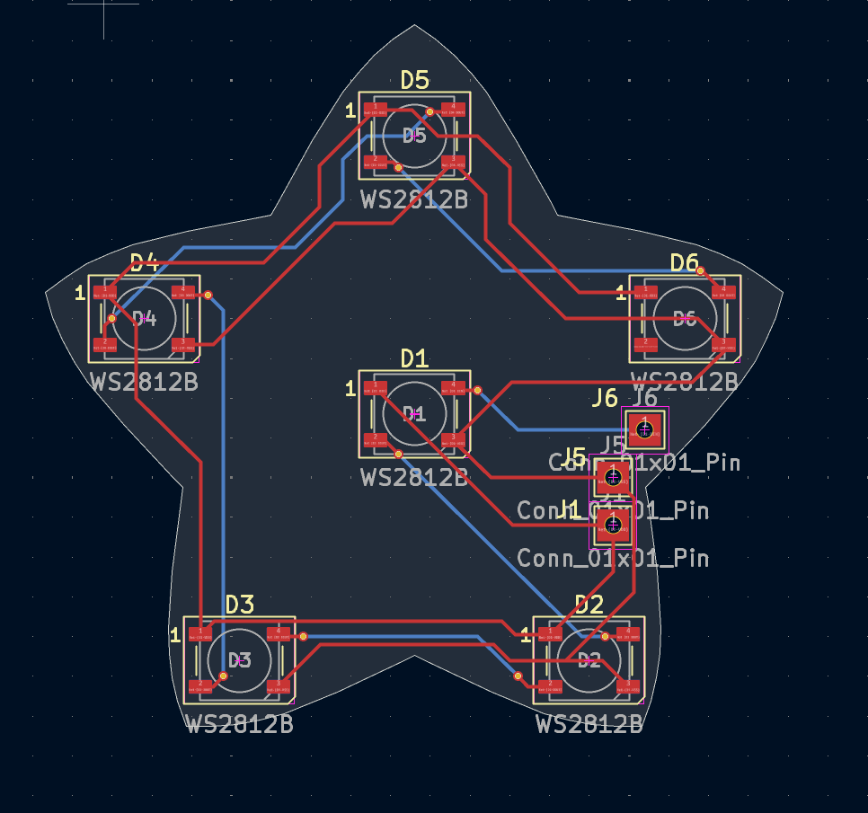
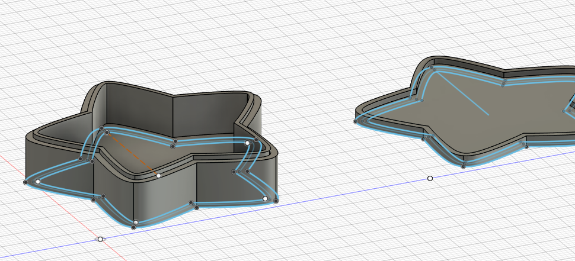
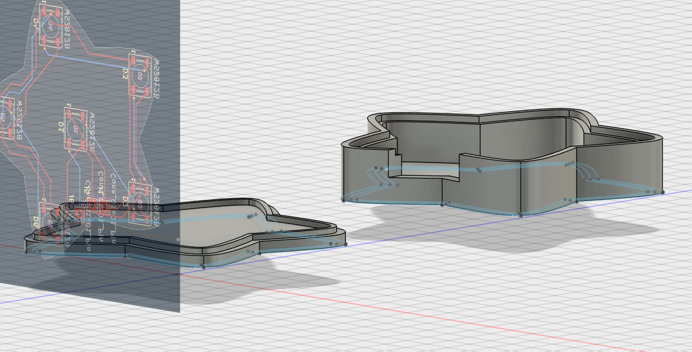
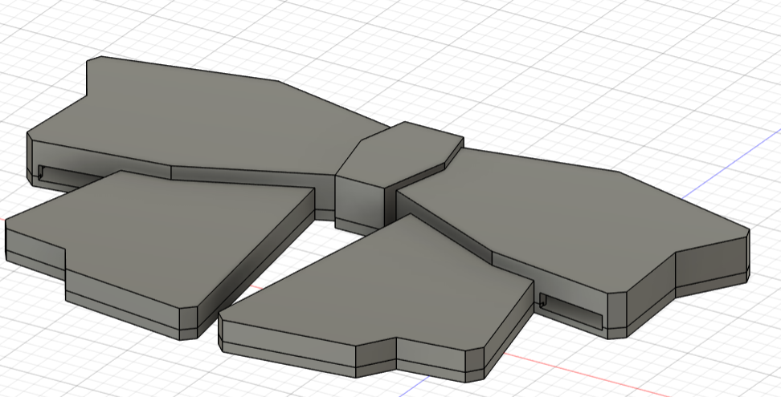
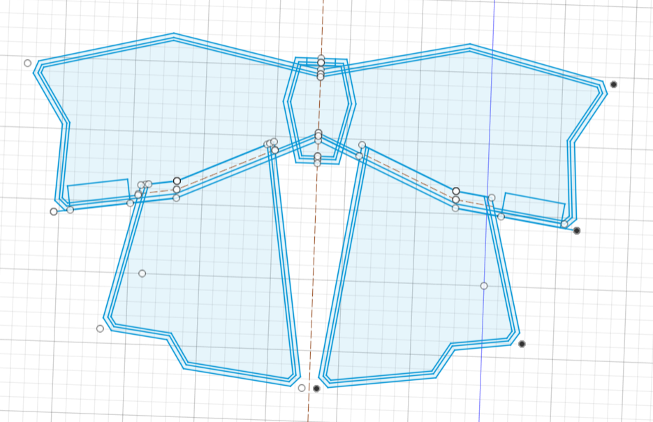
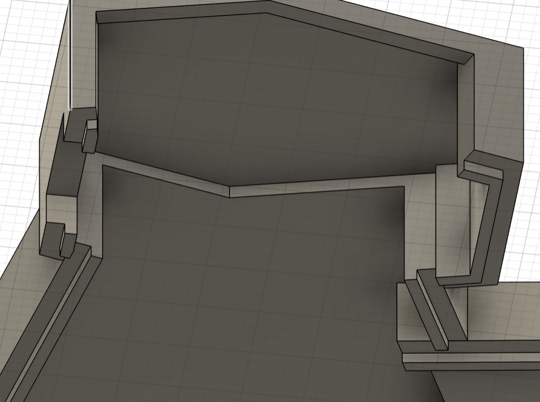

## July 1: Started the design :D

I have no idea what I'm doing ):

Looked through many components today to work on my BOM. Downloaded Fusion 360 to work on casing :O

Decided that tbh using Adafruit Sparkle Motion Mini and using WLED is easier than buying an esp32, i2s mems mic, level shifter, resistor, etc... so... prebuilt mini pcb for the win ig. I'm saving money :star_struck:

Due to my lack of knowledge of hardware: have discovered a problem with my original thought (3 separate led chains, one for center bow connected to either pin 32/33 on front, 2 for star clips, connected to gpio pins on back) - gpio pins on the back are 3V, not 5V, and I do not want to deal with a level shifter for just one chain of leds so I'm just combining one star led chain to the bow chain and putting both on the front which has the level shifter built in yayyyy.

Have realized magnetic connectors are very expensive ):
However, I do not want to deal with jst connectors because I will have these wired exposed and I want to use my own white silicone wires to have a droop effect and I do not want to crimp them for jst connectors, so magnetic connector it is.

Started schematic for project, but I did not understand how connecters work in schematic. ): I'm using the schematic to show wiring for the whole project, but only part is a pcb, so that I put in a heirarchical sheet. Don't think this is how they're meant to be used oops.

Pcb itself will be star shaped for the clip, just connecting leds together and have 3 holes to connect wires to. There exists some sense of rotational symmetry, as such same pcb can be used for both left and right star clip, just rotated. Star drawn with kaleidescope symmetry, imported graphic into Kicad to trace on edge cuts later.

My beautiful star shape:

Accidentally used the wrong symbol in schematic so pins were wrong in the pcb :sob: Had to redo them. There is probably a more efficient way to use Kicad but I don't know how to do that so I have to redo basically most my pcb :smiley: ... work for tmr

My incorrect symbols that had me redo everything:

I have learned: pay attention the to notch and pins ):
Neopixels are in fact built diff.

Time spent today: 3hr

## July 2: still doing design ):

Hopefully this pcb works :D 

Have fixed it and Kicad design rules checker says it works?
Will be soldering wire directly to holes on the side.

Will hopefully add a pretty silkscreen later if I have time :D
Because there is quite literally nothing but leds on this, it is very empty and sad right now.

Also just realized I have forgotten to commit to Github since yesterday oops :smiley:

Thinking about how to make the sparkle motion mini functional aka what I need for power which I have determined is:

- lipo battery
- power booster (bc battery is 3.7V, leds are 5V)
- slide switch

I have acquired a slide switch yayy I do not need to order a single slide switch :D

Unfortunately my new to hardware brain could not figure out how to put these together so ...

Spending too much time trying to understand how to wire this stuff. I dont understand batteries rip.

This took a really long time to think about I swear :sob:

I don't know if I planned it correctly but hopefully!

also I accidentally messed up my github so idk I accidentally pulled before stashing rip I had to redo this

Time spent today: 3h

Man I feel like I spend so much longer just searching things up and not understanding things :smiley:
this hardware stuff hard man

## July 3: cad

Fusion 360 is the most frustrating program I have ever used omg :sob:

Took too long to plan :pensive: learned about circular placement and mirroring in sketch! but bezier curves are annoying rip

Star clip measurements bc I don't want to write them down somewhere else :D
- base: 2mm
- wall: 2.5mm
- lip: 1mm (recess 1.15mm)
- height (beyond base): 8mm
- top: 1.2mm

Time spent today: 2h

## July 4: continuing cad ):

Have realized I should probably change how this works, with the base being flat and the top having the walls.

So had to redo this ):

also actually I offset original sketch by 1mm for more clearance for pcb

Actually going insane because I'm spending like an hour just trying to offset this singular star shape and it's just not allowing me to select lines, or its not letting me select shapes because these points are white (unconnected) except there is literally only one point so how is it unconnected :sob:

Going through exporting as a sketch and importing it again just to try and make this shape correct but it's still not working :sob:

Thought it was bad yesterday, even worse today ripppp

Ended up just redrawing the star, made it better this time I hope? It should be a correct shape now though, each place where curves intersected I had overlap and trim which ... messes up the curve ... but at least it's a fully constrained shape!

 yayyyy

 Time spent today: 2h

 ## July 12: cad :O

 Drawing the bow itself now :D
 Sketches took a while, originally wanted it to bend a bit but that's too hard so it's staying flat.

bow measurements:
- base: 2mm
- wall: 2.5mm
- lip: 1mm (recess 1.25mm)
- height (beyond base): 
    - center: 12mm
    - wing: 10mm
    - flap: 6mm
- top: 1.2mm

omg this was so complicated to think through :sob:
went through very many different ways of making this work... idk if it does?

math .. hopefully i calculated heights correctly

welp anyway:

please don't judge my sketch :smiley: this is already having deleted some things :smiley:

unfortunatley because it isso messy, it took a long time to actually select where I wanted to extrude :sob:

absolutely disgusting but hopefully it works :smiley:

Then writing readme :D 
downloading everything ughhh

 Time spent today: 5h