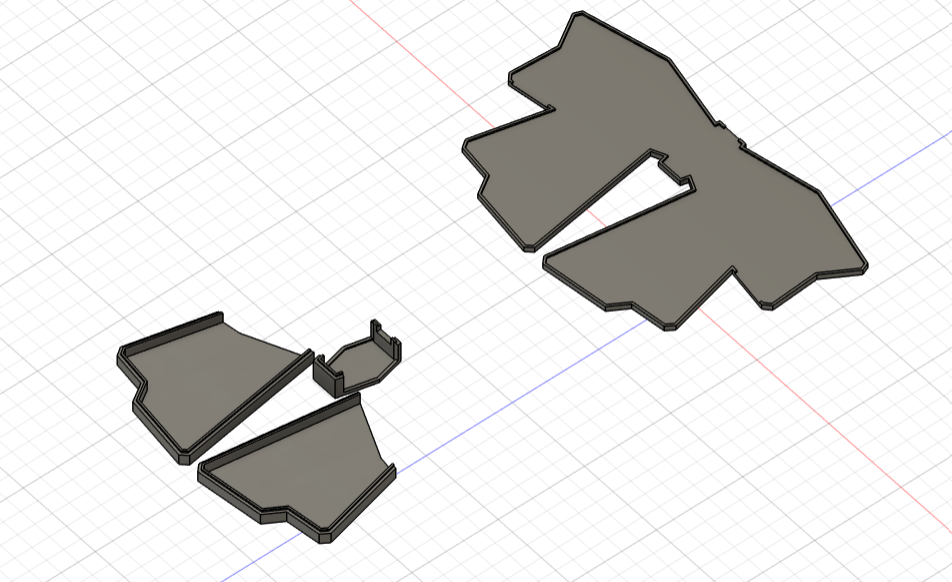
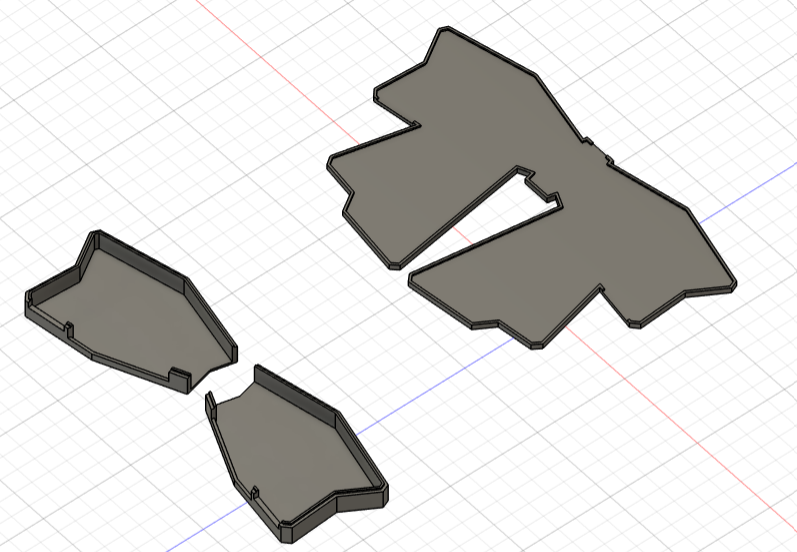

# Starclip

This is a design for a set of hair accesories with incorporated LEDs. This uses the Adafruit Sparkle Motion Mini and WLED to respond to audio.

As of now, this is purely a design, so I have no final images. This will be a hand wired project.

This set consists of one large bow to be placed in the center of the back of the head, along with a star on each side. LEDs are placed around the edges of all parts. The stars are detachable.

## CAD
Made in Fusion 360:

Each part consists of a flat base and an extruded top that fit into each other.

## Wiring
Made in KiCad:

The project schematic is as follows:

While the majority of the project will be hand wired, the stars will be PCBs for ease of assembly.

In total, following a roughly half inch spacing between LEDs in the bow, there will be 18 LEDs in each half of the bow, wrapping around each wing and bottom tail. Each star will have 6 LEDs, ordered such that the light can move in a linear pattern across the star.

This project uses the Adafruit Sparkle Motion Mini, which as an incorporated I2S microphone and level shifters for 5V LEDs. This will be powered by a 3.7V 500mAh LiPo battery, connected to a Adafruit MiniBoost 5V through a JST connector. The switch is connected to the MiniBoost enable pin. 

As the Sparkle Motion Mini only has two output pins shifted to 5V for LEDs, the LED chains will be split per half, consisting of each half of the bow and continuing on to the star clips.

The star clips will be connected to the main bow through magnetic conectors at the bottom edge of the bow. This allows them to be detachable.

The connecting wiring will be visible, following a drooping pattern using white silicone wrapped wire.

## Assembly

Begin with the stars. The PCBs will fit into the star casing, with a cutout on one edge for the wires. The stars have rotational symmetry, which allows them to work for both the left and right side.

Attach all parts to the center bow base plate. There is a cutout on the top of the center piece for the slide switch, and cutouts on the bottom edge of each bow wing for the magnetic connectors. 

Once finished, place the top of the casing on in this order: tails, wings, center.

Attach crocodile clips or preferred type of hair clip.

## Firmware
This project uses [WLED.](https://kno.wled.ge/) This allows for audio responsive LEDs.